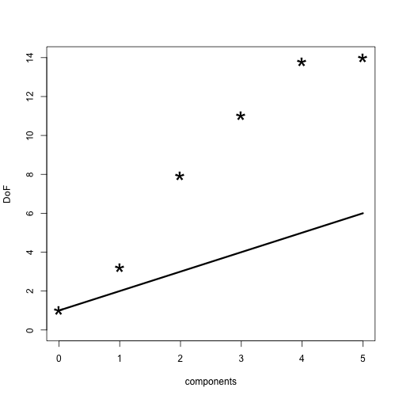

<!-- README.md is generated from README.Rmd. Please edit that file -->


# plsdof 

# Degrees of Freedom and Statistical Inference for Partial Least Squares Regression
## Maintainer: Frédéric Bertrand

<!-- badges: start -->
[](https://lifecycle.r-lib.org/articles/stages.html)
[](https://www.repostatus.org/#active)
[](https://github.com/fbertran/plsdof/actions)
[](https://codecov.io/gh/fbertran/plsdof?branch=master)
[](https://cran.r-project.org/package=plsdof)
[](https://cran.r-project.org/package=plsdof)
[](https://github.com/fbertran/plsdof)
[](https://zenodo.org/badge/latestdoi/167805443)
<!-- badges: end -->


The plsdof package provides Degrees of Freedom estimates
        for Partial Least Squares (PLS) Regression. Model selection for
        PLS is based on various information criteria (aic, bic, gmdl)
        or on cross-validation. Estimates for the mean and covariance
        of the PLS regression coefficients are available. They allow
        the construction of approximate confidence intervals and the
        application of test procedures.
        Further, cross-validation procedures for Ridge Regression and 
        Principal Components Regression are available.


The plsdof package was fully coded and developped by Nicole Kraemer and Mikio L. Braun. It is mainly based on the article by N. Kraemer, M. Sugiyama (2012): "The Degrees of Freedom of Partial Least Squares Regression", *Journal of the American Statistical Association*, **106**(494):697-705, [doi:10.1198/jasa.2011.tm10107](http://dx.doi.org/doi:10.1198/jasa.2011.tm10107).


Yet due to the regular updates in CRAN policies, it was removed from the CRAN and orphaned since the former maintainer had stopped updating the package. The plsdof package is required by several packages of Frédéric Bertrand who was then selected as the new maintainer since late 2018. 

This website and these examples were created by F. Bertrand.


## Installation

You can install the released version of plsdof from [CRAN](https://CRAN.R-project.org) with:


```r
install.packages("plsdof")
```

You can install the development version of plsdof from [github](https://github.com) with:


```r
devtools::install_github("fbertran/plsdof")
```

## Example

### PLS model example.

The pls.model function computes the Partial Least Squares fit.


```r
n<-50 # number of observations
p<-15 # number of variables
X<-matrix(rnorm(n*p),ncol=p)
y<-rnorm(n)

ntest<-200 #
Xtest<-matrix(rnorm(ntest*p),ncol=p) # test data
ytest<-rnorm(ntest) # test data

library(plsdof)
#> Loading required package: MASS
# compute PLS + degrees of freedom + prediction on Xtest
first.object<-pls.model(X,y,compute.DoF=TRUE,Xtest=Xtest,ytest=NULL)

# compute PLS + test error
second.object=pls.model(X,y,m=10,Xtest=Xtest,ytest=ytest)
```

### Model selection for Partial Least Squares based on information criteria

The pls.ic function computes the optimal model parameters using one of three different model selection criteria (aic, bic, gmdl) and based on two different Degrees of Freedom estimates for PLS.


```r
n<-50 # number of observations
p<-5 # number of variables
X<-matrix(rnorm(n*p),ncol=p)
y<-rnorm(n)

# compute linear PLS
pls.object<-pls.ic(X,y,m=ncol(X))
```

### Boston Housing data
Creating response vector and predictors' matrix

```r
data(Boston)
X<-as.matrix(Boston[,-14])
y<-as.vector(Boston[,14])
```

Compute PLS coefficients for the first 5 components. 

```r
my.pls1<-pls.model(X,y,m=5,compute.DoF=TRUE)
my.pls1
#> $prediction
#> NULL
#> 
#> $mse
#> NULL
#> 
#> $cor
#> NULL
#> 
#> $coefficients
#>       [,1]         [,2]          [,3]         [,4]
#>  [1,]    0 -0.076940293 -7.179141e-02 -0.061149836
#>  [2,]    0  0.026340436  1.633952e-02  0.019291126
#>  [3,]    0 -0.120173852 -6.897626e-02 -0.065593023
#>  [4,]    0  1.176027512  5.056388e+00  2.318600674
#>  [5,]    0 -6.285097120 -1.270127e+00 -6.044717827
#>  [6,]    0  1.686742132  5.033484e+00  5.080289305
#>  [7,]    0 -0.022823694 -3.105829e-06 -0.008308712
#>  [8,]    0  0.202290444 -5.364488e-01 -0.815830735
#>  [9,]    0 -0.074698950  1.484043e-02  0.087376561
#> [10,]    0 -0.004738110 -2.423533e-03 -0.001361691
#> [11,]    0 -0.399753339 -8.878165e-01 -0.757332477
#> [12,]    0  0.006225242  7.546263e-03  0.010402233
#> [13,]    0 -0.176056810 -3.944517e-01 -0.485094820
#>                [,5]          [,6]
#>  [1,]  -0.095832430  -0.090441291
#>  [2,]   0.021349410   0.041016177
#>  [3,]  -0.044474123  -0.042020602
#>  [4,]   2.425954562   3.006787730
#>  [5,] -11.913979017 -16.342218106
#>  [6,]   4.087176232   3.644299060
#>  [7,]  -0.006986349  -0.007936337
#>  [8,]  -1.325763220  -1.538527491
#>  [9,]   0.128528988   0.182869562
#> [10,]  -0.003557385  -0.004707172
#> [11,]  -0.867688251  -0.980442101
#> [12,]   0.013058054   0.009338351
#> [13,]  -0.534827058  -0.545636629
#> 
#> $intercept
#> [1] 22.53281 27.48424 13.66421 14.32197 27.74488
#> [6] 37.04155
#> 
#> $DoF
#> [1]  1.000000  3.199237  7.950736 11.017539
#> [5] 13.805606 14.000000
#> 
#> $RSS
#> [1] 42716.30 21387.31 12542.59 11833.57 11407.92
#> [6] 11203.95
#> 
#> $Yhat
#>            [,1]      [,2]       [,3]       [,4]
#>   [1,] 22.53281 28.729119 30.7607088 30.5996766
#>   [2,] 22.53281 26.169386 25.2639350 24.9938387
#>   [3,] 22.53281 28.738634 31.0945081 31.4595735
#>   [4,] 22.53281 29.513732 29.6245416 30.1106861
#>   [5,] 22.53281 29.163871 29.4462617 29.6598495
#>   [6,] 22.53281 27.858607 25.8664098 26.0115831
#>   [7,] 22.53281 25.664036 23.8398418 22.9143124
#>   [8,] 22.53281 24.160171 21.7909481 19.9141231
#>   [9,] 22.53281 21.218296 14.6627472 11.6856881
#>  [10,] 22.53281 24.534910 21.3310686 19.5088333
#>  [11,] 22.53281 24.364862 22.0586692 19.9662082
#>  [12,] 22.53281 25.279675 23.1436843 21.8243920
#>  [13,] 22.53281 25.454692 21.9469221 20.9636742
#>  [14,] 22.53281 23.520748 20.2010080 20.5153637
#>  [15,] 22.53281 22.743092 20.1557383 20.1276458
#>  [16,] 22.53281 23.360722 19.6419140 20.0305538
#>  [17,] 22.53281 24.397222 20.7990915 21.5691788
#>  [18,] 22.53281 21.841170 18.0323888 17.7006253
#>  [19,] 22.53281 21.791107 16.0285808 16.1664264
#>  [20,] 22.53281 22.210141 18.3292163 18.5340318
#>  [21,] 22.53281 19.448066 13.5498829 12.5910831
#>  [22,] 22.53281 21.756792 18.4083667 18.1751269
#>  [23,] 22.53281 21.128141 17.3950725 16.7325276
#>  [24,] 22.53281 20.207556 15.2177155 14.3233011
#>  [25,] 22.53281 21.238322 17.0408065 16.4369147
#>  [26,] 22.53281 20.283121 14.6000988 13.7576857
#>  [27,] 22.53281 21.354673 16.7922841 16.2202485
#>  [28,] 22.53281 20.841783 16.5660702 15.6590986
#>  [29,] 22.53281 22.780422 21.2160950 20.9202867
#>  [30,] 22.53281 23.279478 22.4816180 22.3681701
#>  [31,] 22.53281 19.497626 13.2979674 12.0661829
#>  [32,] 22.53281 21.725740 19.0159335 18.6843789
#>  [33,] 22.53281 18.410802 11.6245093  9.7474198
#>  [34,] 22.53281 20.104580 15.1410656 14.4072501
#>  [35,] 22.53281 19.648465 15.4923623 14.2779660
#>  [36,] 22.53281 24.153301 22.2043114 22.6931808
#>  [37,] 22.53281 23.729348 20.9010759 21.2255071
#>  [38,] 22.53281 24.897772 21.8365518 22.4656138
#>  [39,] 22.53281 25.065421 21.8976348 22.5180831
#>  [40,] 22.53281 31.100951 28.9071885 29.9830972
#>  [41,] 22.53281 32.372957 31.9890853 33.3470469
#>  [42,] 22.53281 29.402142 28.2043085 28.9049443
#>  [43,] 22.53281 28.119406 24.7801514 25.3283258
#>  [44,] 22.53281 27.973223 24.4310076 24.8660929
#>  [45,] 22.53281 26.568891 22.8482288 22.7923030
#>  [46,] 22.53281 25.858913 21.0259923 21.1389464
#>  [47,] 22.53281 25.350778 19.9941202 19.7591413
#>  [48,] 22.53281 23.842387 19.0376297 17.7830270
#>  [49,] 22.53281 20.500476 11.0568497  8.5643803
#>  [50,] 22.53281 24.221766 17.7273531 16.7840733
#>  [51,] 22.53281 26.915652 21.6478950 20.9381102
#>  [52,] 22.53281 27.478528 23.9898846 23.5028889
#>  [53,] 22.53281 29.850879 27.6416250 27.9058150
#>  [54,] 22.53281 28.424446 23.8171961 23.7693170
#>  [55,] 22.53281 25.711067 17.1345862 17.1659043
#>  [56,] 22.53281 33.678992 31.0852385 31.4495683
#>  [57,] 22.53281 31.772801 26.3107559 26.0452674
#>  [58,] 22.53281 33.759626 31.9809271 32.0018500
#>  [59,] 22.53281 27.352636 22.0535141 22.4493011
#>  [60,] 22.53281 26.022682 20.5494410 20.8354638
#>  [61,] 22.53281 24.628061 17.8887516 17.5654417
#>  [62,] 22.53281 23.969609 18.6005190 18.0101799
#>  [63,] 22.53281 26.942016 24.0363251 24.3197897
#>  [64,] 22.53281 27.670724 24.0676559 24.1023762
#>  [65,] 22.53281 30.000754 26.9349439 26.1915102
#>  [66,] 22.53281 31.540097 28.4464748 29.2103002
#>  [67,] 22.53281 29.406863 23.7169244 23.8419445
#>  [68,] 22.53281 26.801368 21.2653967 21.8303368
#>  [69,] 22.53281 25.090646 17.8671577 17.8413866
#>  [70,] 22.53281 26.425830 21.0285855 21.4376829
#>  [71,] 22.53281 27.111909 24.3702790 25.4681008
#>  [72,] 22.53281 25.489943 20.7722088 21.4530821
#>  [73,] 22.53281 26.746493 23.1257707 24.3264637
#>  [74,] 22.53281 26.637472 23.1238762 24.1250472
#>  [75,] 22.53281 26.023932 24.3261012 25.7362602
#>  [76,] 22.53281 24.752232 23.3153214 24.1030140
#>  [77,] 22.53281 23.382493 22.2537453 22.6200165
#>  [78,] 22.53281 24.194029 22.3056055 23.0849651
#>  [79,] 22.53281 23.990169 21.4546539 21.7251119
#>  [80,] 22.53281 24.301580 21.2760662 22.1362614
#>  [81,] 22.53281 28.866660 27.5746890 28.5386583
#>  [82,] 22.53281 27.494333 26.2598321 26.7337384
#>  [83,] 22.53281 27.928053 24.8717225 25.6969287
#>  [84,] 22.53281 27.191428 23.8333783 24.4423365
#>  [85,] 22.53281 26.753928 24.5972553 24.8474308
#>  [86,] 22.53281 27.421297 27.1772619 27.7339286
#>  [87,] 22.53281 25.541840 21.6186954 21.6775813
#>  [88,] 22.53281 26.087552 24.2525075 24.8074994
#>  [89,] 22.53281 27.496363 30.6354545 31.0151914
#>  [90,] 22.53281 28.105696 30.9168276 31.4740704
#>  [91,] 22.53281 26.284209 26.5019153 26.8002258
#>  [92,] 22.53281 26.202404 26.6930904 26.9852363
#>  [93,] 22.53281 26.047870 25.9597992 26.7084182
#>  [94,] 22.53281 26.574528 25.5772366 26.7005745
#>  [95,] 22.53281 24.754988 24.0712479 24.4133559
#>  [96,] 22.53281 27.298239 27.8209540 28.4250794
#>  [97,] 22.53281 25.635201 23.9014129 24.0573918
#>  [98,] 22.53281 29.990462 36.3454973 37.1983588
#>  [99,] 22.53281 30.557564 35.3220966 36.5360250
#> [100,] 22.53281 28.852565 32.2814098 33.0358036
#> [101,] 22.53281 23.512134 24.6239154 25.4757135
#> [102,] 22.53281 24.131187 25.5526900 26.6171702
#> [103,] 22.53281 20.594787 20.1092422 19.8838711
#> [104,] 22.53281 21.618617 20.0955831 20.5105592
#> [105,] 22.53281 21.740347 20.8337133 21.4053174
#> [106,] 22.53281 20.271007 17.7893442 18.0068114
#> [107,] 22.53281 19.997870 16.8036185 16.8376957
#> [108,] 22.53281 21.381690 20.0612114 20.5803322
#> [109,] 22.53281 22.125865 22.4163284 22.9526055
#> [110,] 22.53281 21.257106 19.7891559 20.0243033
#> [111,] 22.53281 22.561735 20.5273845 21.2375121
#> [112,] 22.53281 23.904524 26.8515492 27.2464697
#> [113,] 22.53281 21.157432 20.5956491 20.3997461
#> [114,] 22.53281 21.291271 21.0527445 20.7169429
#> [115,] 22.53281 22.885540 24.5878900 25.0118498
#> [116,] 22.53281 21.076213 20.4087562 20.1203314
#> [117,] 22.53281 22.866099 23.3492555 23.6032113
#> [118,] 22.53281 22.690013 23.2538379 23.5731999
#> [119,] 22.53281 21.362010 20.2285750 20.0759022
#> [120,] 22.53281 21.999369 20.4599487 20.5982666
#> [121,] 22.53281 20.729071 19.3723866 19.0545117
#> [122,] 22.53281 20.560171 20.0317997 19.5937488
#> [123,] 22.53281 19.621044 18.4325542 17.6199459
#> [124,] 22.53281 17.951780 14.9671407 13.4557577
#> [125,] 22.53281 19.469465 18.2104353 17.4278886
#> [126,] 22.53281 20.333492 19.8863582 19.4419645
#> [127,] 22.53281 17.123446 13.0145239 11.3590544
#> [128,] 22.53281 17.255541 15.3960605 15.2029279
#> [129,] 22.53281 18.782967 19.8391819 19.8281183
#> [130,] 22.53281 17.009002 14.5492715 14.2268462
#> [131,] 22.53281 19.366621 20.8963663 21.0479828
#> [132,] 22.53281 19.208027 20.2370619 20.3950678
#> [133,] 22.53281 19.470203 20.8472378 21.0550804
#> [134,] 22.53281 17.978261 16.5008722 16.3151080
#> [135,] 22.53281 16.540003 14.3440993 13.6055508
#> [136,] 22.53281 18.386888 18.5432022 18.3031110
#> [137,] 22.53281 17.728617 16.5588376 16.3356045
#> [138,] 22.53281 18.959658 20.2272935 20.2749546
#> [139,] 22.53281 16.730909 14.6568153 14.1118731
#> [140,] 22.53281 17.744780 17.2802551 17.0277932
#> [141,] 22.53281 16.831310 15.1297838 14.3854271
#> [142,] 22.53281 12.849554  5.3360174  3.6429712
#> [143,] 22.53281 17.265494 20.9745063 15.3016967
#> [144,] 22.53281 16.228041 16.2989524 13.3862912
#> [145,] 22.53281 14.908011 12.4529132  9.2763227
#> [146,] 22.53281 15.840979 17.5159136 13.8491191
#> [147,] 22.53281 16.971588 19.3235715 16.6039288
#> [148,] 22.53281 14.975048 12.4027332  9.1716082
#> [149,] 22.53281 15.470667 13.8925190 10.6802411
#> [150,] 22.53281 17.284530 18.6055346 16.0167740
#> [151,] 22.53281 19.641294 24.3332520 22.4379385
#> [152,] 22.53281 18.325720 20.8328785 18.8724243
#> [153,] 22.53281 19.361324 24.4029863 19.8868770
#> [154,] 22.53281 17.892830 20.7131404 18.3225472
#> [155,] 22.53281 20.402137 28.5787304 23.6771221
#> [156,] 22.53281 19.149840 26.8254437 21.4034638
#> [157,] 22.53281 16.117861 16.9854618 14.0566077
#> [158,] 22.53281 24.397403 32.3761088 32.5466371
#> [159,] 22.53281 22.442005 27.2197652 27.1684159
#> [160,] 22.53281 21.410352 28.8062233 27.4468282
#> [161,] 22.53281 24.181481 33.4391427 30.7494029
#> [162,] 22.53281 26.041487 36.2681264 36.7860840
#> [163,] 22.53281 27.623238 42.8755420 40.6194731
#> [164,] 22.53281 28.482937 45.1562804 42.7952937
#> [165,] 22.53281 21.676171 23.9875002 23.4636738
#> [166,] 22.53281 21.342508 24.8087361 24.0558243
#>              [,5]       [,6]
#>   [1,] 30.9306288 30.8192296
#>   [2,] 25.1932571 24.7033459
#>   [3,] 31.1200387 30.3790551
#>   [4,] 29.3840532 28.5251095
#>   [5,] 28.6822471 27.7152539
#>   [6,] 25.7519377 25.1096390
#>   [7,] 23.0105623 22.9379099
#>   [8,] 19.3589116 19.0272235
#>   [9,] 11.0400991 10.8383365
#>  [10,] 18.8538082 18.5299046
#>  [11,] 18.9239222 18.4215300
#>  [12,] 21.5661242 21.3238137
#>  [13,] 21.0246115 21.0395163
#>  [14,] 20.5202319 19.6938069
#>  [15,] 19.9972043 19.1775801
#>  [16,] 20.2353854 19.5118510
#>  [17,] 21.6936465 21.0065727
#>  [18,] 17.5692599 16.7707292
#>  [19,] 16.6289548 16.6038848
#>  [20,] 19.0647773 18.5131894
#>  [21,] 12.7740278 12.2155438
#>  [22,] 18.2585193 17.5041364
#>  [23,] 16.4167175 15.5220393
#>  [24,] 14.2293826 13.4422798
#>  [25,] 16.2554794 15.3982521
#>  [26,] 13.6048424 13.2242029
#>  [27,] 16.0304932 15.2465432
#>  [28,] 15.0316228 14.4311722
#>  [29,] 20.3003870 19.2399935
#>  [30,] 21.6834527 20.6352021
#>  [31,] 11.7620148 11.0946974
#>  [32,] 18.5727160 17.7960895
#>  [33,]  8.7139425  8.4255319
#>  [34,] 14.5504360 14.0336895
#>  [35,] 13.6370357 13.3412307
#>  [36,] 23.8425135 23.7421760
#>  [37,] 22.3096851 22.3062255
#>  [38,] 23.4141201 23.2637235
#>  [39,] 23.3006154 23.1267871
#>  [40,] 30.2212404 31.3059236
#>  [41,] 33.2673507 34.1931033
#>  [42,] 28.6224935 28.1256096
#>  [43,] 25.5934830 25.3564321
#>  [44,] 25.0371772 24.7228456
#>  [45,] 23.0315802 22.7441656
#>  [46,] 22.0562047 22.0432871
#>  [47,] 20.3759222 20.2749220
#>  [48,] 17.6824434 17.2639036
#>  [49,]  8.4242272  8.0922435
#>  [50,] 17.0150419 16.7362140
#>  [51,] 20.7658525 20.8385676
#>  [52,] 23.3998288 23.4379161
#>  [53,] 27.5678907 27.5044192
#>  [54,] 23.7847313 23.9141003
#>  [55,] 15.9869646 16.3510286
#>  [56,] 29.6594021 30.3318332
#>  [57,] 24.5278017 25.1263320
#>  [58,] 31.1094373 32.4983479
#>  [59,] 21.5468374 21.2902349
#>  [60,] 20.5243955 20.4861457
#>  [61,] 17.1128047 17.0408802
#>  [62,] 17.4673925 17.4060776
#>  [63,] 23.4845309 23.1569365
#>  [64,] 22.4039293 21.7783271
#>  [65,] 23.7978594 22.7022588
#>  [66,] 29.4070535 30.8014998
#>  [67,] 24.2785368 25.8229490
#>  [68,] 21.8526749 21.7214221
#>  [69,] 17.9171087 17.8409155
#>  [70,] 21.4334887 21.2784696
#>  [71,] 25.6930068 25.4164471
#>  [72,] 21.9676294 21.8741454
#>  [73,] 24.9811625 24.8456378
#>  [74,] 24.4583215 24.2744316
#>  [75,] 26.4525552 26.3208644
#>  [76,] 24.5908980 24.3831969
#>  [77,] 23.2072083 23.0732909
#>  [78,] 23.8730862 23.7886707
#>  [79,] 21.8579682 21.5083363
#>  [80,] 23.0487073 22.9819375
#>  [81,] 28.4654404 28.4377710
#>  [82,] 26.7170947 26.6860818
#>  [83,] 25.9731051 26.1194113
#>  [84,] 24.8158810 25.0229407
#>  [85,] 25.1246266 24.7650135
#>  [86,] 28.0979607 27.7471694
#>  [87,] 22.3383708 22.1904531
#>  [88,] 25.9419455 25.9315713
#>  [89,] 31.3543304 30.8364352
#>  [90,] 31.7026448 31.1773774
#>  [91,] 27.6897508 27.5041522
#>  [92,] 27.9313311 27.7451368
#>  [93,] 27.7922362 28.2353619
#>  [94,] 28.0820834 28.6670755
#>  [95,] 25.6302789 26.1139022
#>  [96,] 29.1176143 29.0771444
#>  [97,] 25.0812470 25.0575300
#>  [98,] 36.7056586 35.8899824
#>  [99,] 36.2631353 35.6141235
#> [100,] 33.0770960 32.5417588
#> [101,] 25.6668405 24.9398819
#> [102,] 26.7937692 26.0500871
#> [103,] 19.5108965 20.1271320
#> [104,] 21.1268403 20.6254433
#> [105,] 22.1979833 21.7615504
#> [106,] 19.0802932 18.7944257
#> [107,] 17.7606936 17.4343896
#> [108,] 21.4581256 21.1070274
#> [109,] 23.4538641 22.8632920
#> [110,] 20.5253834 20.0052407
#> [111,] 21.7432533 21.2419362
#> [112,] 27.6199837 27.1394035
#> [113,] 21.4465902 21.3165232
#> [114,] 21.4480796 21.1787257
#> [115,] 26.0272556 25.8605143
#> [116,] 20.9779399 21.0136117
#> [117,] 24.3725126 24.1164585
#> [118,] 24.5900427 24.4037712
#> [119,] 20.9659450 21.0650547
#> [120,] 21.7016938 21.6332590
#> [121,] 20.5985898 20.3755578
#> [122,] 21.0289328 20.7895026
#> [123,] 18.9841735 18.7379273
#> [124,] 14.6076994 14.3827723
#> [125,] 18.9391284 18.7426066
#> [126,] 20.9942798 20.7695947
#> [127,] 12.7164401 12.6625626
#> [128,] 16.0299934 15.3057308
#> [129,] 20.0135692 18.9566516
#> [130,] 14.9440572 14.1781705
#> [131,] 21.1840183 20.0870983
#> [132,] 20.5751114 19.5066992
#> [133,] 21.2089637 20.1584995
#> [134,] 16.7615862 15.8721933
#> [135,] 13.7134751 13.3236417
#> [136,] 18.3389849 17.2542837
#> [137,] 16.7964157 15.9812841
#> [138,] 20.4493779 19.3940002
#> [139,] 14.6347604 13.8168103
#> [140,] 17.4031774 16.4697116
#> [141,] 14.4631458 13.5054898
#> [142,]  4.4314346  3.8795296
#> [143,] 15.5296255 15.2316118
#> [144,] 13.3892848 12.4709689
#> [145,]  9.7740889  9.0839826
#> [146,] 12.5870285 12.1829714
#> [147,] 16.3432888 16.2736688
#> [148,]  9.5737040  8.8654543
#> [149,] 10.7558026 10.0615965
#> [150,] 16.0016425 15.2207522
#> [151,] 22.3160669 21.2764623
#> [152,] 19.4441183 18.8496061
#> [153,] 21.0048468 21.1765147
#> [154,] 18.2142374 17.7520112
#> [155,] 23.4071024 23.0987804
#> [156,] 20.4074447 20.9817405
#> [157,] 13.8305821 14.1846027
#> [158,] 33.5016367 33.3563950
#> [159,] 28.9380256 29.2204882
#> [160,] 27.1869673 26.0443576
#> [161,] 32.4217897 33.2672442
#> [162,] 37.3055187 36.8961125
#> [163,] 40.9276289 40.8820326
#> [164,] 42.4050652 42.0714614
#> [165,] 24.9131983 24.9511218
#> [166,] 24.9881629 25.5448691
#>  [ getOption("max.print") est atteint -- 340 lignes omises ]
#> 
#> $sigmahat
#> [1] 9.197104 6.515513 5.013279 4.884552 4.809437
#> [6] 4.767186
#> 
#> $yhat
#> [1] 256910.0 278239.0 287083.7 287792.8 288218.4
#> [6] 288422.4
#> 
#> $covariance
#> NULL
```

Plot Degrees of Freedom and add naive estimate.

```r
plot(0:5,my.pls1$DoF,pch="*",cex=3,xlab="components",ylab="DoF",ylim=c(0,14))
lines(0:5,1:6,lwd=3)
```



Model selection with the Bayesian Information criterion

```r
my.pls2<-pls.ic(X,y,criterion="bic")
my.pls2
#> $DoF
#>  [1]  1.000000  3.199237  7.950736 11.017539
#>  [5] 13.805606 14.000000 13.762687 13.914104
#>  [9] 13.944634 13.923915 13.961410 13.994897
#> [13] 13.994188 13.999297
#> 
#> $m.opt
#> [1] 9
#> 
#> $sigmahat
#>  [1] 9.197104 6.515513 5.013279 4.884552 4.809437
#>  [6] 4.767186 4.752327 4.745271 4.740682 4.740264
#> [11] 4.740301 4.740459 4.740455 4.740480
#> 
#> $m.crash
#> [1] NA
#> 
#> $intercept
#> [1] 36.75988
#> 
#> $coefficients
#>  [1] -1.095593e-01  4.530660e-02  2.363634e-02
#>  [4]  2.585699e+00 -1.829747e+01  3.849407e+00
#>  [7]  5.666419e-04 -1.475727e+00  3.022631e-01
#> [10] -1.191852e-02 -9.797141e-01  9.355828e-03
#> [13] -5.173293e-01
#> 
#> $covariance
#> NULL
#> 
#> attr(,"class")
#> [1] "plsdof"
```

Model selection based on cross-validation. 


```r
my.pls3<-pls.cv(X,y,compute.covariance=TRUE)
my.pls3
#> $cv.error.matrix
#>            0        1        2        3        4
#> 1   81.48633 51.44559 35.16610 34.45574 32.54481
#> 2   77.47886 44.21098 21.19789 23.65043 22.83424
#> 3   76.40734 26.44913 15.06778 14.82615 16.82769
#> 4  112.67437 63.96923 33.23523 32.57976 32.16262
#> 5   91.21078 40.50482 27.44353 25.98485 25.50374
#> 6   66.85061 22.69165 33.04676 28.97080 27.04067
#> 7   62.49267 23.26411 14.57746 15.02826 14.37221
#> 8  101.33361 75.99940 42.29182 37.63489 35.40890
#> 9  101.67477 43.26474 21.48613 21.62615 23.10763
#> 10  76.38572 37.47748 16.03572 15.48752 16.38434
#>           5        6        7        8        9
#> 1  31.24341 29.33186 29.04834 29.49608 29.30611
#> 2  21.83682 22.79332 22.83256 23.05391 22.96070
#> 3  15.61066 15.31389 14.78831 14.46982 14.55079
#> 4  30.82523 30.09558 30.05240 30.17974 30.14948
#> 5  27.41505 27.69208 28.39821 28.00764 27.94737
#> 6  26.22845 25.20978 26.10463 25.45697 25.54533
#> 7  13.26914 12.56941 13.02418 12.97540 12.89894
#> 8  35.80444 35.90628 35.32799 35.58669 35.54719
#> 9  22.47744 21.82144 21.57269 21.74467 21.67671
#> 10 17.13126 16.47626 16.23612 15.80853 15.83372
#>          10       11       12       13
#> 1  29.24739 29.27384 29.27684 29.27828
#> 2  23.03196 23.03821 23.04452 23.04513
#> 3  14.53771 14.53821 14.53945 14.53944
#> 4  30.16106 30.16103 30.15933 30.15947
#> 5  27.89835 27.90151 27.90220 27.90225
#> 6  25.54633 25.55782 25.55361 25.55361
#> 7  12.92403 12.91921 12.92194 12.92258
#> 8  35.54367 35.53967 35.53986 35.54028
#> 9  21.74356 21.76239 21.75675 21.75676
#> 10 15.89882 15.90221 15.90137 15.90200
#> 
#> $cor.error.matrix
#>     0         1         2         3         4
#> 1  NA 0.6127155 0.7544289 0.7597003 0.7752494
#> 2  NA 0.6647246 0.8502017 0.8276442 0.8365273
#> 3  NA 0.8179992 0.8991603 0.9003066 0.8847086
#> 4  NA 0.6768973 0.8391205 0.8422488 0.8445674
#> 5  NA 0.7529552 0.8362090 0.8474244 0.8519359
#> 6  NA 0.8193274 0.7842778 0.8188733 0.8263257
#> 7  NA 0.8059905 0.8652151 0.8615114 0.8666065
#> 8  NA 0.4920328 0.7633945 0.7986847 0.8090888
#> 9  NA 0.7662867 0.8939504 0.8927218 0.8838201
#> 10 NA 0.7129599 0.8951202 0.8946199 0.8868082
#>            5         6         7         8
#> 1  0.7851974 0.7996130 0.8017155 0.7982541
#> 2  0.8446849 0.8370991 0.8366385 0.8353495
#> 3  0.8934686 0.8957093 0.8997327 0.9025520
#> 4  0.8529853 0.8570693 0.8567651 0.8560732
#> 5  0.8387058 0.8372906 0.8331570 0.8365132
#> 6  0.8326868 0.8376018 0.8326424 0.8357685
#> 7  0.8791010 0.8854392 0.8812219 0.8821859
#> 8  0.8076791 0.8083366 0.8113404 0.8099541
#> 9  0.8871439 0.8908130 0.8926397 0.8916992
#> 10 0.8811725 0.8863438 0.8878384 0.8909090
#>            9        10        11        12
#> 1  0.7996783 0.8001137 0.7999030 0.7998775
#> 2  0.8360858 0.8354545 0.8354062 0.8353607
#> 3  0.9018507 0.9019020 0.9019072 0.9018983
#> 4  0.8561657 0.8561051 0.8561069 0.8561181
#> 5  0.8369081 0.8373084 0.8372813 0.8372760
#> 6  0.8355441 0.8354323 0.8353820 0.8354073
#> 7  0.8827469 0.8825853 0.8826466 0.8826181
#> 8  0.8098260 0.8098178 0.8098348 0.8098319
#> 9  0.8921001 0.8918350 0.8917290 0.8917584
#> 10 0.8905561 0.8900998 0.8900638 0.8900711
#>           13
#> 1  0.7998663
#> 2  0.8353568
#> 3  0.9018982
#> 4  0.8561178
#> 5  0.8372758
#> 6  0.8354074
#> 7  0.8826125
#> 8  0.8098285
#> 9  0.8917582
#> 10 0.8900669
#> 
#> $cv.error
#>        0        1        2        3        4 
#> 84.79951 42.92771 25.95484 25.02445 24.61869 
#>        5        6        7        8        9 
#> 24.18419 23.72099 23.73854 23.67795 23.64163 
#>       10       11       12       13 
#> 23.65329 23.65941 23.65959 23.65998 
#> 
#> $cor.error
#>         0         1         2         3         4 
#>        NA 0.7121889 0.8381078 0.8443735 0.8465638 
#>         5         6         7         8         9 
#> 0.8502825 0.8535316 0.8533691 0.8539259 0.8541462 
#>        10        11        12        13 
#> 0.8540654 0.8540261 0.8540217 0.8540188 
#> 
#> $m.opt
#> 9 
#> 9 
#> 
#> $m.opt.cor
#> 9 
#> 9 
#> 
#> $covariance
#>                [,1]          [,2]          [,3]
#>  [1,]  1.086410e-03 -5.076629e-05  1.215701e-06
#>  [2,] -5.076629e-05  1.815093e-04  6.798659e-05
#>  [3,]  1.215701e-06  6.798659e-05  3.590812e-03
#>  [4,]  1.595709e-03 -9.871798e-06 -5.653498e-03
#>  [5,]  6.752246e-03  1.545571e-03 -5.892059e-02
#>  [6,]  3.339180e-04 -8.894086e-04  2.006702e-03
#>  [7,] -4.791263e-07  1.917824e-05  1.059044e-05
#>  [8,]  7.567258e-04 -1.081208e-03  2.775527e-03
#>  [9,] -5.581490e-04  1.111242e-04  1.287885e-03
#> [10,]  2.038486e-06 -1.079125e-05 -1.018165e-04
#> [11,]  1.745782e-05  5.186241e-04 -1.242530e-03
#> [12,]  1.116225e-05 -1.453175e-07  6.402235e-06
#> [13,] -2.312113e-04 -2.475010e-05 -2.151428e-04
#>                [,4]          [,5]          [,6]
#>  [1,]  1.595709e-03  0.0067522458  0.0003339180
#>  [2,] -9.871798e-06  0.0015455710 -0.0008894086
#>  [3,] -5.653498e-03 -0.0589205856  0.0020067017
#>  [4,]  7.503986e-01 -0.0975701288 -0.0178389133
#>  [5,] -9.757013e-02 14.2938868439  0.1756499899
#>  [6,] -1.783891e-02  0.1756499899  0.1711956944
#>  [7,] -4.942786e-04 -0.0138601532 -0.0010026374
#>  [8,]  1.683481e-03  0.2125123160  0.0122929669
#>  [9,] -6.332513e-03 -0.0368698939 -0.0040738583
#> [10,]  3.892439e-04 -0.0009693586  0.0001059155
#> [11,]  1.198902e-02  0.1607187810  0.0080874083
#> [12,] -1.303103e-04  0.0007968771  0.0001155193
#> [13,]  1.730885e-03 -0.0092169020  0.0108802831
#>                [,7]          [,8]          [,9]
#>  [1,] -4.791263e-07  7.567258e-04 -5.581490e-04
#>  [2,]  1.917824e-05 -1.081208e-03  1.111242e-04
#>  [3,]  1.059044e-05  2.775527e-03  1.287885e-03
#>  [4,] -4.942786e-04  1.683481e-03 -6.332513e-03
#>  [5,] -1.386015e-02  2.125123e-01 -3.686989e-02
#>  [6,] -1.002637e-03  1.229297e-02 -4.073858e-03
#>  [7,]  1.673281e-04  7.376613e-04  6.182345e-05
#>  [8,]  7.376613e-04  3.956039e-02  2.268693e-04
#>  [9,]  6.182345e-05  2.268693e-04  4.397963e-03
#> [10,] -1.329731e-06 -1.980991e-05 -2.007108e-04
#> [11,] -1.415947e-04 -2.459028e-03 -1.556782e-03
#> [12,] -2.051451e-06  1.423113e-05  1.312686e-05
#> [13,] -2.079047e-04 -2.234535e-04 -1.131858e-04
#>               [,10]         [,11]         [,12]
#>  [1,]  2.038486e-06  1.745782e-05  1.116225e-05
#>  [2,] -1.079125e-05  5.186241e-04 -1.453175e-07
#>  [3,] -1.018165e-04 -1.242530e-03  6.402235e-06
#>  [4,]  3.892439e-04  1.198902e-02 -1.303103e-04
#>  [5,] -9.693586e-04  1.607188e-01  7.968771e-04
#>  [6,]  1.059155e-04  8.087408e-03  1.155193e-04
#>  [7,] -1.329731e-06 -1.415947e-04 -2.051451e-06
#>  [8,] -1.980991e-05 -2.459028e-03  1.423113e-05
#>  [9,] -2.007108e-04 -1.556782e-03  1.312686e-05
#> [10,]  1.428706e-05 -3.164170e-05  2.522537e-07
#> [11,] -3.164170e-05  1.685685e-02 -1.389869e-05
#> [12,]  2.522537e-07 -1.389869e-05  7.340543e-06
#> [13,]  3.967201e-07 -2.848746e-04  2.101876e-05
#>               [,13]
#>  [1,] -2.312113e-04
#>  [2,] -2.475010e-05
#>  [3,] -2.151428e-04
#>  [4,]  1.730885e-03
#>  [5,] -9.216902e-03
#>  [6,]  1.088028e-02
#>  [7,] -2.079047e-04
#>  [8,] -2.234535e-04
#>  [9,] -1.131858e-04
#> [10,]  3.967201e-07
#> [11,] -2.848746e-04
#> [12,]  2.101876e-05
#> [13,]  2.478275e-03
#> 
#> $intercept
#> [1] 36.57564
#> 
#> $intercept.cor
#> [1] 36.57564
#> 
#> $coefficients
#>  [1] -1.086060e-01  4.510260e-02  2.365844e-02
#>  [4]  2.724366e+00 -1.818039e+01  3.832171e+00
#>  [7]  1.943294e-04 -1.471001e+00  3.053293e-01
#> [10] -1.213482e-02 -9.609637e-01  9.325012e-03
#> [13] -5.214224e-01
#> 
#> $coefficients.cor
#>  [1] -1.086060e-01  4.510260e-02  2.365844e-02
#>  [4]  2.724366e+00 -1.818039e+01  3.832171e+00
#>  [7]  1.943294e-04 -1.471001e+00  3.053293e-01
#> [10] -1.213482e-02 -9.609637e-01  9.325012e-03
#> [13] -5.214224e-01
#> 
#> attr(,"class")
#> [1] "plsdof"
```

Returns the estimated covariance matrix of the regression coefficients

```r
my.vcov<-vcov(my.pls3)
my.vcov
#>                [,1]          [,2]          [,3]
#>  [1,]  1.086410e-03 -5.076629e-05  1.215701e-06
#>  [2,] -5.076629e-05  1.815093e-04  6.798659e-05
#>  [3,]  1.215701e-06  6.798659e-05  3.590812e-03
#>  [4,]  1.595709e-03 -9.871798e-06 -5.653498e-03
#>  [5,]  6.752246e-03  1.545571e-03 -5.892059e-02
#>  [6,]  3.339180e-04 -8.894086e-04  2.006702e-03
#>  [7,] -4.791263e-07  1.917824e-05  1.059044e-05
#>  [8,]  7.567258e-04 -1.081208e-03  2.775527e-03
#>  [9,] -5.581490e-04  1.111242e-04  1.287885e-03
#> [10,]  2.038486e-06 -1.079125e-05 -1.018165e-04
#> [11,]  1.745782e-05  5.186241e-04 -1.242530e-03
#> [12,]  1.116225e-05 -1.453175e-07  6.402235e-06
#> [13,] -2.312113e-04 -2.475010e-05 -2.151428e-04
#>                [,4]          [,5]          [,6]
#>  [1,]  1.595709e-03  0.0067522458  0.0003339180
#>  [2,] -9.871798e-06  0.0015455710 -0.0008894086
#>  [3,] -5.653498e-03 -0.0589205856  0.0020067017
#>  [4,]  7.503986e-01 -0.0975701288 -0.0178389133
#>  [5,] -9.757013e-02 14.2938868439  0.1756499899
#>  [6,] -1.783891e-02  0.1756499899  0.1711956944
#>  [7,] -4.942786e-04 -0.0138601532 -0.0010026374
#>  [8,]  1.683481e-03  0.2125123160  0.0122929669
#>  [9,] -6.332513e-03 -0.0368698939 -0.0040738583
#> [10,]  3.892439e-04 -0.0009693586  0.0001059155
#> [11,]  1.198902e-02  0.1607187810  0.0080874083
#> [12,] -1.303103e-04  0.0007968771  0.0001155193
#> [13,]  1.730885e-03 -0.0092169020  0.0108802831
#>                [,7]          [,8]          [,9]
#>  [1,] -4.791263e-07  7.567258e-04 -5.581490e-04
#>  [2,]  1.917824e-05 -1.081208e-03  1.111242e-04
#>  [3,]  1.059044e-05  2.775527e-03  1.287885e-03
#>  [4,] -4.942786e-04  1.683481e-03 -6.332513e-03
#>  [5,] -1.386015e-02  2.125123e-01 -3.686989e-02
#>  [6,] -1.002637e-03  1.229297e-02 -4.073858e-03
#>  [7,]  1.673281e-04  7.376613e-04  6.182345e-05
#>  [8,]  7.376613e-04  3.956039e-02  2.268693e-04
#>  [9,]  6.182345e-05  2.268693e-04  4.397963e-03
#> [10,] -1.329731e-06 -1.980991e-05 -2.007108e-04
#> [11,] -1.415947e-04 -2.459028e-03 -1.556782e-03
#> [12,] -2.051451e-06  1.423113e-05  1.312686e-05
#> [13,] -2.079047e-04 -2.234535e-04 -1.131858e-04
#>               [,10]         [,11]         [,12]
#>  [1,]  2.038486e-06  1.745782e-05  1.116225e-05
#>  [2,] -1.079125e-05  5.186241e-04 -1.453175e-07
#>  [3,] -1.018165e-04 -1.242530e-03  6.402235e-06
#>  [4,]  3.892439e-04  1.198902e-02 -1.303103e-04
#>  [5,] -9.693586e-04  1.607188e-01  7.968771e-04
#>  [6,]  1.059155e-04  8.087408e-03  1.155193e-04
#>  [7,] -1.329731e-06 -1.415947e-04 -2.051451e-06
#>  [8,] -1.980991e-05 -2.459028e-03  1.423113e-05
#>  [9,] -2.007108e-04 -1.556782e-03  1.312686e-05
#> [10,]  1.428706e-05 -3.164170e-05  2.522537e-07
#> [11,] -3.164170e-05  1.685685e-02 -1.389869e-05
#> [12,]  2.522537e-07 -1.389869e-05  7.340543e-06
#> [13,]  3.967201e-07 -2.848746e-04  2.101876e-05
#>               [,13]
#>  [1,] -2.312113e-04
#>  [2,] -2.475010e-05
#>  [3,] -2.151428e-04
#>  [4,]  1.730885e-03
#>  [5,] -9.216902e-03
#>  [6,]  1.088028e-02
#>  [7,] -2.079047e-04
#>  [8,] -2.234535e-04
#>  [9,] -1.131858e-04
#> [10,]  3.967201e-07
#> [11,] -2.848746e-04
#> [12,]  2.101876e-05
#> [13,]  2.478275e-03
```

Standard deviation of the regression coefficients

```r
my.sd<-sqrt(diag(my.vcov)) 
my.sd
#>  [1] 0.032960732 0.013472539 0.059923383
#>  [4] 0.866255477 3.780725703 0.413758014
#>  [7] 0.012935536 0.198897943 0.066317142
#> [10] 0.003779823 0.129833933 0.002709344
#> [13] 0.049782275
```
